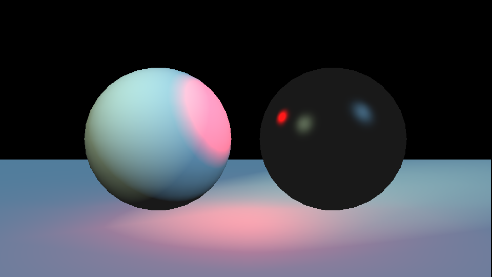

# rasterizer-workshop

Starter code for the Michigan Computer Graphics workshop on rasterization.



## Installation

Clone the repository:

```bash
git clone https://github.com/MichiganCG/raster-workshop.git
```

## Usage

To compile the project, use the make command:

```bash
make
# or
make rasterizer
# or
make rasterizer_release # compiles with optimization
```

Run the script:

```bash
./rasterizer
```

It will produce the file `output.png`.
