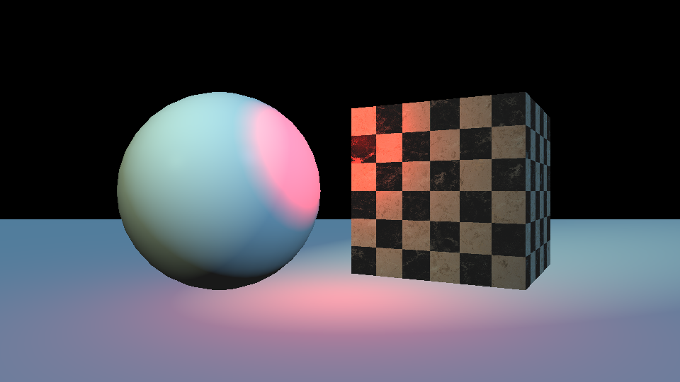

# rasterizer-workshop

Starter code for the Michigan Computer Graphics (MCG) workshop on rasterization. This is a simple software rasterizer designed to help people learn about rasterization rendering by providing an example.



## Installation

Clone the repository:

```bash
git clone https://github.com/MichiganCG/rasterizer-workshop.git
```

## Usage

To compile the project, use the make command:

```bash
make
# or
make rasterizer
# or
make rasterizer_release # compiles with optimization
```

Run the script:

```bash
./rasterizer
```

It will produce the image file `output.png`.

## License

This project is licensed under the [GNU GPLv3](COPYING).
